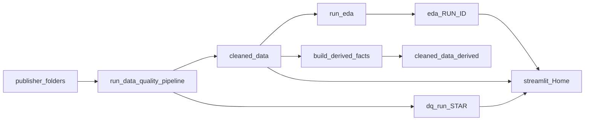

# UK Renewable Energy Market Intelligence

Cleaned multi-publisher UK energy and renewables statistics, deterministic data-quality processing, exploratory analytics, derived analytical fact tables, and a Streamlit dashboard for inventory, drift, and UK-focused briefs.

Sources covered in tooling defaults include **DESNZ**, **ONS**, **Ofgem**, **IRENA**, and **MCS** (publisher folders under the repository root).

## Features

- Deterministic ingestion of `.xlsx`, `.xls`, and `.ods` workbooks with trimming, header detection, footnote-token handling, and explicit issue reporting.
- Optional **schema contracts** in [`config/dataset_registry.yml`](config/dataset_registry.yml): violations surface as high-severity `schema_contract_violation` issues in the DQ run.
- **Parquet and CSV** exports per cleaned sheet under `cleaned_data/<publisher>/`.
- Per-run **data quality** artifacts: JSON reports per workbook, flat issue register, manifest, summary, and checksums under `dq_run_<RUN_ID>/`.
- **EDA** over all cleaned sheets: narrative report (`EDA_REPORT.md`), section markdown, and CSV/JSON/PNG artifacts under `eda/<RUN_ID>/`.
- **Derived UK-focused fact tables** (capacity factors, UK renewables joins, LCREE productivity, ECUK reconciliation, solar learning curves, price volatility, MCS battery metrics, and more) under `cleaned_data/derived/`.
- **Streamlit** multi-page app for exploration, drift signals, and integrated briefs.

## Repository layout

| Path | Role |
|------|------|
| `DESNZ/`, `ONS/`, `Ofgem/`, `IRENA/`, `MCS/` | Raw publisher workbooks (place files here before running the DQ pipeline). |
| `cleaned_data/` | Normalised sheet exports (Parquet + CSV) produced by the DQ pipeline; `cleaned_data/derived/` holds built fact tables. |
| `dq_run_<RUN_ID>/` | One directory per DQ run: reports, manifest, issues, `SUMMARY.md`, checksums. |
| `eda/<RUN_ID>/` | One directory per EDA run: master report, `sections/`, `artifacts/`, `manifest.json`. |
| `scripts/` | `run_data_quality_pipeline.py`, `run_eda.py`, `build_derived_facts.py`, and `scripts/eda/` modules. |
| `streamlit_app/` | `Home.py` and `pages/` for the dashboard. |
| `config/` | `dataset_registry.yml` and reference data (e.g. CPI under `config/reference/`). |
| [`requirements.txt`](requirements.txt) | Aggregates DQ + EDA + app runtime dependencies (equivalent to installing the three `requirements-*.txt` files). |
| [`requirements-dev.txt`](requirements-dev.txt) | Lint, typecheck, tests, and audit tooling (includes `requirements.txt`). |
| `tests/` | Pytest suite (smoke tests; extend as needed). |

## Prerequisites

- **Python 3.11** (recommended; matches the version targeted in CI).
- Sufficient disk space for raw workbooks and generated Parquet/CSV outputs. Large binaries may be omitted from version control in your clone; obtain publisher files from official sources as needed.

## Installation

Create a virtual environment, upgrade pip, then install the stacks you need.

**Full stack** (DQ + EDA + Streamlit app):

```bash
python3.11 -m venv .venv
source .venv/bin/activate   # Windows: .venv\Scripts\activate
python -m pip install --upgrade pip
pip install -r requirements-dq.txt -r requirements-eda.txt -r requirements-app.txt
```

Same runtime stack in one file: **`pip install -r requirements.txt`** ( [`requirements.txt`](requirements.txt) pulls in DQ, EDA, and app requirements).

**Minimal installs**

- **DQ pipeline only:** `pip install -r requirements-dq.txt`
- **EDA** (expects DQ dependencies): `pip install -r requirements-dq.txt -r requirements-eda.txt`
- **App only** (if you already have cleaned data and only want the UI): `pip install -r requirements-app.txt` — you may still need overlapping packages from `requirements-dq.txt` for data loading (e.g. `pandas`, `pyarrow`).

## How to run

Run commands from the **repository root** unless you pass explicit paths.

### 1. Data quality and cleaning

```bash
python scripts/run_data_quality_pipeline.py
```

| Argument | Default |
|----------|---------|
| `--repo` | Directory containing `scripts/` (repository root). |
| `--audit-out` | `<repo>/dq_run_<RUN_ID>` where `<RUN_ID>` is UTC `YYYYMMDDTHHMMSSZ`. |
| `--cleaned-out` | `<repo>/cleaned_data`. |
| `--roots` | `DESNZ`, `MCS`, `ONS`, `Ofgem`, `IRENA` (each must be a folder under `--repo`). |

Example: limit to two publishers and a custom audit folder:

```bash
python scripts/run_data_quality_pipeline.py --roots DESNZ ONS --audit-out ./my_dq_run
```

### 2. Exploratory data analysis

Requires populated `cleaned_data/` (typically from step 1).

```bash
python scripts/run_eda.py
```

| Argument | Default |
|----------|---------|
| `--repo` | Parent of `scripts/` (repository root). |
| `--cleaned-root` | `<repo>/cleaned_data`. |
| `--out-root` | `<repo>/eda` (run writes to `eda/<RUN_ID>/`). |

### 3. Derived fact tables

Reads cleaned sheets and writes Parquet fact tables (see docstring in [`scripts/build_derived_facts.py`](scripts/build_derived_facts.py) for the full list).

```bash
python scripts/build_derived_facts.py
```

| Argument | Default |
|----------|---------|
| `--cleaned-root` | `cleaned_data` (relative to current working directory). |
| `--out-dir` | `cleaned_data/derived`. |

Run from repo root so paths resolve as expected, or pass absolute paths.

### 4. Streamlit dashboard

```bash
streamlit run streamlit_app/Home.py
```

Equivalent from the repo root (same app): `streamlit run Home.py`. The root [`Home.py`](Home.py) and [`pages`](pages) entries are **symlinks** into [`streamlit_app/`](streamlit_app/) so hosts such as **Streamlit Community Cloud** can use a main file path of **`Home.py`** at the repository root next to a top-level **`pages/`** directory.

**Streamlit Community Cloud — automatic pipelines:** On a fresh deploy there is no `cleaned_data/` (it is not committed). Importing [`streamlit_app/_lib.py`](streamlit_app/_lib.py) (used by every page) runs [`streamlit_app/pipeline_bootstrap.py`](streamlit_app/pipeline_bootstrap.py) once: **data quality** → **EDA** → **derived facts**, in that order, via the same CLIs as locally. A lock file avoids duplicate runs across workers. The first visitor may wait several minutes; check **Streamlit / GitHub logs** for `[pipeline_bootstrap]` lines.

Control via environment variables (e.g. Cloud **Secrets** → `UK_RE_MI_SKIP_BOOTSTRAP`, or shell):

| Variable | Effect |
|----------|--------|
| `UK_RE_MI_SKIP_BOOTSTRAP=1` | Do **not** run subprocess pipelines (use only if `cleaned_data/` is already present). |
| `UK_RE_MI_FORCE_BOOTSTRAP=1` | Delete the completion marker and **re-run** all pipeline steps on next load. |

Use **`requirements.txt`** (full stack) as the Cloud Python dependency file so DQ/EDA/cli imports resolve during bootstrap.

The app discovers the latest DQ and EDA runs and lists cleaned sheets from `cleaned_data/`. Pages include inventory, sheet explorer, IRENA views, drift, UK renewables, LCREE productivity, data quality, an integrated UK transition brief, and ECUK heat / reconciliation.

## Outputs

- **`cleaned_data/`** — One set of files per cleaned sheet (Parquet for analysis, CSV for interchange). Sidecar metadata CSVs may accompany exports. Derived pipelines add **`cleaned_data/derived/`** Parquet tables built by `build_derived_facts.py`.
- **`dq_run_<RUN_ID>/`** — Auditable run: per-workbook JSON reports, merged issue tables, `manifest.json`, human-readable `SUMMARY.md`, and `SHA256SUMS` for reproducibility.
- **`eda/<RUN_ID>/`** — `EDA_REPORT.md`, per-topic sections under `sections/`, and numerical artefacts under `artifacts/` (inventory, missingness, drift, crosswalks, etc.).
- **`cleaned_data/derived/`** — Analytical facts (e.g. `capacity_factor.parquet`, `uk_renewables_fact.parquet`, `integrated_productivity.parquet`) consumed by the app and further analysis.

## Data provenance and licensing

Raw spreadsheets are **third-party publications** (government departments, regulators, and international agencies). Terms of use, attribution, and redistribution rules belong to each publisher. This repository provides **processing tooling and derived analytical outputs for research and transparency**; it does not supply legal guidance on dataset redistribution. Ensure your use complies with each source’s licence and citation requirements.

## Development and CI

Install linting, tests, and type checking with **`pip install -r requirements-dev.txt`** (includes the full runtime stack via [`requirements.txt`](requirements.txt), plus Ruff, Mypy, pytest, coverage, and pip-audit).

Checks aligned with [`.github/workflows/ci.yml`](.github/workflows/ci.yml):

```bash
ruff check scripts streamlit_app tests
mypy scripts streamlit_app
pytest tests/ --cov=scripts --cov=streamlit_app
```

CI runs on push and pull requests (Python 3.11): Ruff on `scripts/`, `streamlit_app/`, and `tests/`; Mypy on `scripts/` and `streamlit_app/` (see [`pyproject.toml`](pyproject.toml)); pytest with coverage; **pip-audit** against [`requirements.txt`](requirements.txt) is informational (`|| true` in the workflow).

## Pipeline overview


